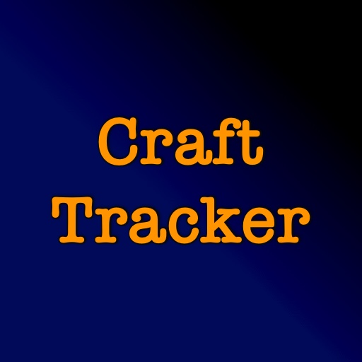

# Craft Tracker

## Overview 

**Craft Tracker** is a **Minecraft** mod made for **Minecraft Forge**.

* Add items to a queue to keep track of what you need
* Setup a shopping list so you know what to gather
* Share the shopping list with other players so they can help

## Required Mods

* [JEI](https://www.curseforge.com/minecraft/mc-mods/jei) &mdash; version 9.7.2.281 or higher

## Where To Get It

Download it from [CurseForge](https://www.curseforge.com/minecraft/mc-mods/craft-tracker) or [Modrinth](https://modrinth.com/mod/craft-tracker).
